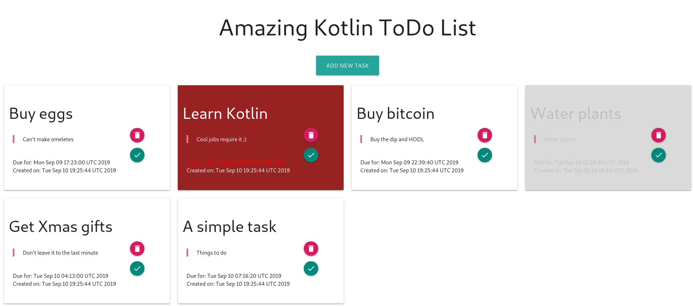

### Date 4.0
Time to get some styling going

#### 3.1
I was familiar with [Materialize](https://materializecss.com) from a previous project so I decided to go with that for styling.

Incorporating static files was simple enough, only requiring some editing of the Javalin initialization.

Did some editing on `tasks.mustache` so that each task would appear on it's own cell.

#### 3.2
One snag is that Mustache does not have any logic in it's templating language... So I had to hack it a bit so that completed/late tasks would appear with a different style.

If I were to start over I'd go for a templating engine that has some logic (if statements, loops, etc).

#### 3.3
Right now I'm adding the modal that will have the form so a user can input a new task. 

The only snag has been getting the datepicker to return a proper value. I want it to return a Unix timestamp but in order to do that I'd have to edit the javascript files from Materialize. Instead, I think I'll edit my DAO so that it handles the string conversion into a unix timestamp when handling the POST request.

#### 3.4
Looking through Kotlin's documentation for a convenience function for converting datetimes.

It turns out Kotlin does not have it's own class to handle time, it uses Java's classes for that. After some searching I found a simple way to convert the string passed by the new task form into a unix time. Edits made to `TaskDAO`.

Also fixing the ordering of the tasks by their due date.

#### 3.5
The last major piece of the backend is to setup a routine that checks for the tasks due date versus the current date and changes their status to late if necessary.

Realized I need a new method in the `TaskDAO` that changes the status of a task (only a method to change it to complete exists right now)

#### 3.6
Implemented two new methods in `TaskDAO`:
* `checkStatuses` : checks each task marked as todo. If they are behind schedule, marks them as late using `changeStatus()`.
* `changeStatus` : receives a task ID and a status string (one of "todo|complete|late"). Changes the status of the task as requested.

Implemented a recurrent function using `java.util.Timer` and `kotlin.concurrent.schedule`. Every interval (determined in milliseconds), `TaskDAO.checkStatuses()` is called  to update the tasks' status.

#### 3.7
Fix a small display bug. I was sorting tasks based on their formated strings for due dates and not their UNIX timestamps.

**I think this project is pretty much finished now! There is a lot of space for further improvements and I might use this project as a platform for learning other aspects of Kotlin. Regardless I will write some of my conclusions on a separate file.**
